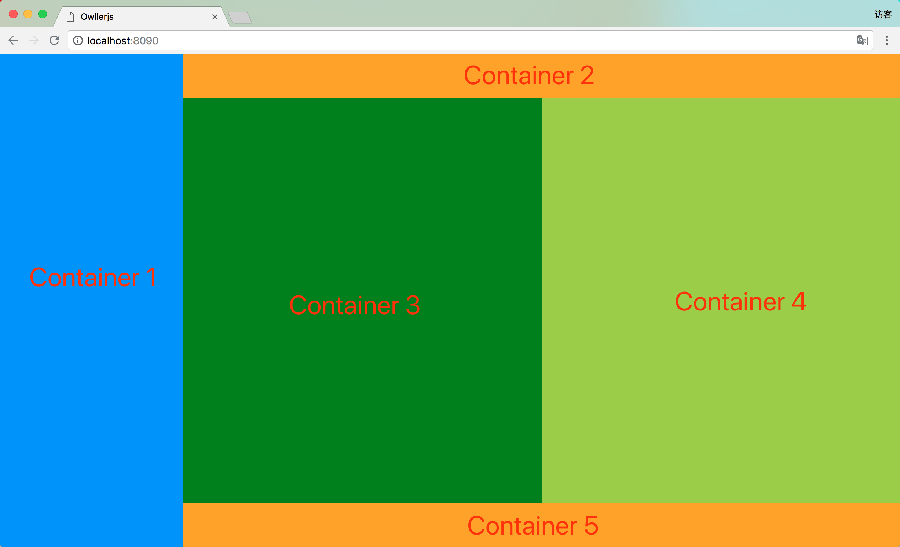

Layout
=

Layout是一种常用的网页布局，我们把网页看作是一块画布，然后把这张画布任意切割为若干个小块，每一个小块即为一个容器，随后可在该容器中进行各种操作而不影响其他容器。

样例
-

样例代码
```javascript
	//整个浏览器窗口或用户自定义元素块
	<owl-layout childrenlayout="h" style="background: white;">
		//Container 1
        <owl-layout width="250px" style="background: dodgerblue;"></owl-layout>
        //Container (2+3+4+5)
        <owl-layout childrenlayout="v" style="background: white;">
        	//Container 2
            <owl-layout height="60px" style="background: orange;"></owl-layout>		
            //Container (3+4)
            <owl-layout childrenlayout="h" style="background: yellow;">		
            	//Container 3
                <owl-layout style="background: green;"></owl-layout>	
                //Container 4
                <owl-layout style="background: yellowgreen;"></owl-layout>		
            </owl-layout>
            //Container 5
            <owl-layout height="60px" style="background: orange;"></owl-layout>		
        </owl-layout>
    </owl-layout>
```

使用
-

```javascript
	<owl-layout childrenlayout="h" width="300px" height="100%"></owl-layout>
```

每一个owl-layout标签即为一个container(容器)，此标签可以嵌套使用，最外层的owl-layout标签可以挂载到body标签下(我们假设body标签为一个最外层的layout标签)，也可挂载到用户自定义标签下，即可，layout渲染器会自动渲染。

`childrenlayout`属性表示该容器下如果有自容器的话，这些自容易的排列方式，`h`为水平排列，`v`为垂直排列，如果子容器排列方式为水平排列，则子容器的高度固定设置为100%，如果子容器排列方式为垂直排列，则子容器的宽度固定设置为100%，无法通过width，height属性进行修改。

<font color="red">请使用width，height属性对container的宽度，高度进行设定，不要用css的方式对其进行设定。</font>

属性
-
|	属性名称		|	属性描述		|	示例值	|	备注		|
|:-------------:|:-------------:|:----------:|:---:|
|	childrenlayout		|	该容器的子容器的排列方式		|	h:水平排列，v:垂直排列	|该值默认为'v',如果没有子容器，则可忽略该属性|
|	width		|	该容器的宽度		|	"100px", "100%"	|如果自身排列方式为垂直排列则固定为100%，请忽略该属性|
|	height		|	该容器的高度		|	"100px", "100%"	|如果自身排列方式为水平排列则固定为100%，请忽略该属性|